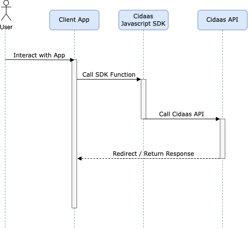

# Overview

Cidaas Javascript SDK make integrating cidaas to your client application easier. It manages tokens and communicate with cidaas apis.

After adding Cidaas Javascript SDK Library to client side application and configure it using config provider, it will be able to integrate cidaas functionalities such as:

* authenticating user using PKCE flow
* session management
* user management
* consent management
* implementing multifactor authentication

Aside from that, Cidaas Javascript SDK also provide useful functionalities such as:

* managing access token after user authentication (store, retrieve, renewal)
* automatically assign access token to api calls which needs it
* providing data model for each of cidaas api calls
* offline access token check