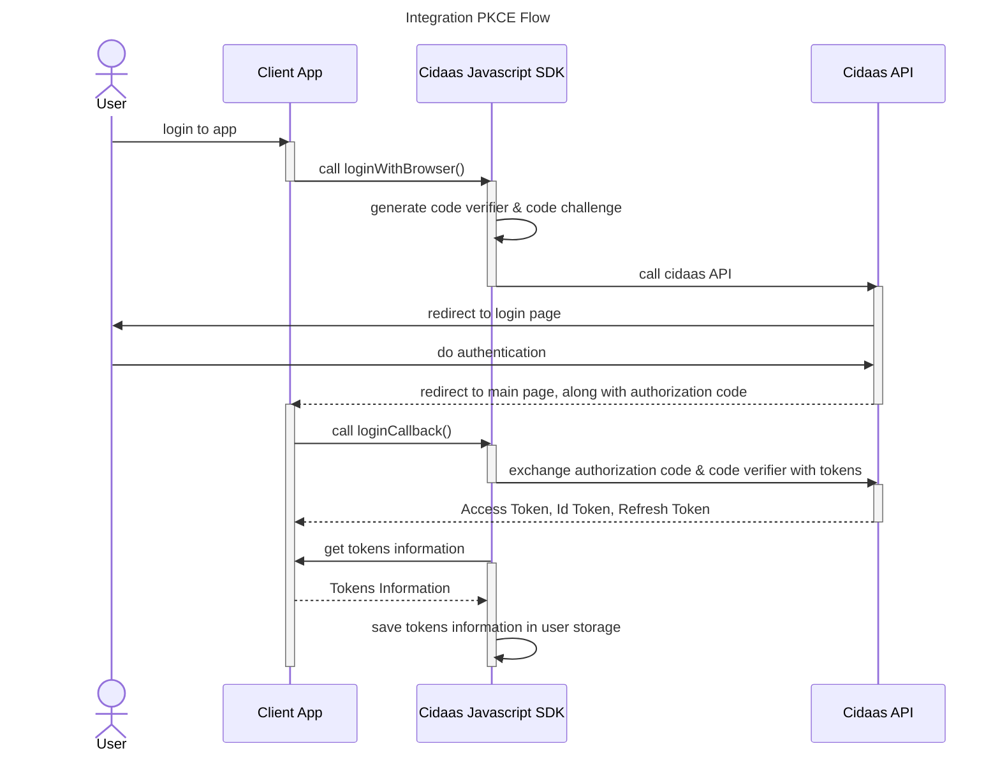
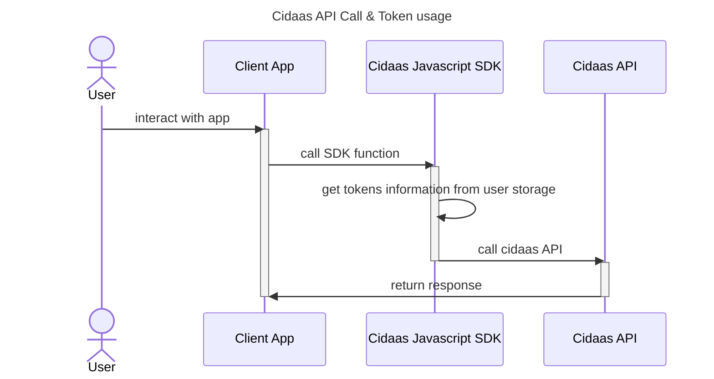

# Overview

Cidaas Javascript SDK helps integrating cidaas to your client application easily. It manages tokens and communicate with cidaas apis.

After adding Cidaas Javascript SDK Library to client side application and configure it using oidc settings, it will be able to integrate cidaas functionalities such as:

* authenticating user using PKCE flow
* session management
* user management
* consent management
* implementing multifactor authentication

Aside from that, Cidaas Javascript SDK also provide useful functionalities such as:

* access token management (store, retrieve, renewal)
* automatically assign access token to api calls which needs it
* providing data model for each of cidaas api calls
* offline access token check

# Integrating PKCE Flow

By calling loginWithBrowser() function, the sdk will call cidaas authz url, which will resolve into user predefined login url. This could be either in form of default hosted page or custom login page, if configured.

After successful user authentication in the login page, user will be be redirected to predefined redirecturl, which has been configured in configuration file, alongside with code to be exchanged as tokens. 

By calling loginCallback() from the redirect url afterwards, the SDK will exchange the code from cidaas into tokens. This includes Access Token, Id Token & Refresh Token. The SDK will saved the tokens afterwards as default behaviour. This can be disabled.

# Storing & Getting Tokens Information

After successful authentication using SDK PKCE Flow, tokens information such as access token, id token as well as refresh token will be saved by the SDK in user storage by default.
User Profile Information which are contained in id token will also be stored in the user storage

By calling getUserInfoFromStorage(), this informations can be retrieved. Javascript SDK will set the token on each of Cidaas API request, when it is needed.

