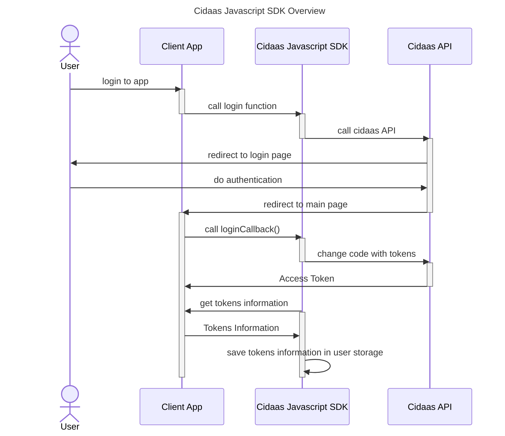

# Overview

Cidaas Javascript SDK make integrating cidaas to your client application easier. It manages tokens and communicate with cidaas apis.

After adding Cidaas Javascript SDK Library to client side application and configure it using config provider, it will be able to integrate cidaas functionalities such as:

* authenticating user using PKCE flow
* session management
* user management
* consent management
* implementing multifactor authentication

Aside from that, Cidaas Javascript SDK also provide useful functionalities such as:

* managing access token after user authentication (store, retrieve, renewal)
* automatically assign access token to api calls which needs it
* providing data model for each of cidaas api calls
* offline access token check

# Integrating PKCE Flow

By calling loginWithBrowser() function, the sdk will call cidaas authz url, which will resolve into user predefined login url. This could be either in form of default hosted page or custom login page, if configured.

After successful user authentication in the login page, user will be be redirected to predefined redirecturl, which has been configured in configuration file, alongside with code to be exchanged as tokens. 

By calling loginCallback() from the redirect url afterwards, the SDK will exchange the code from cidaas into tokens. This includes Access Token, Id Token & Refresh Token. The SDK will saved the tokens afterwards as default behaviour. This can be disabled.

