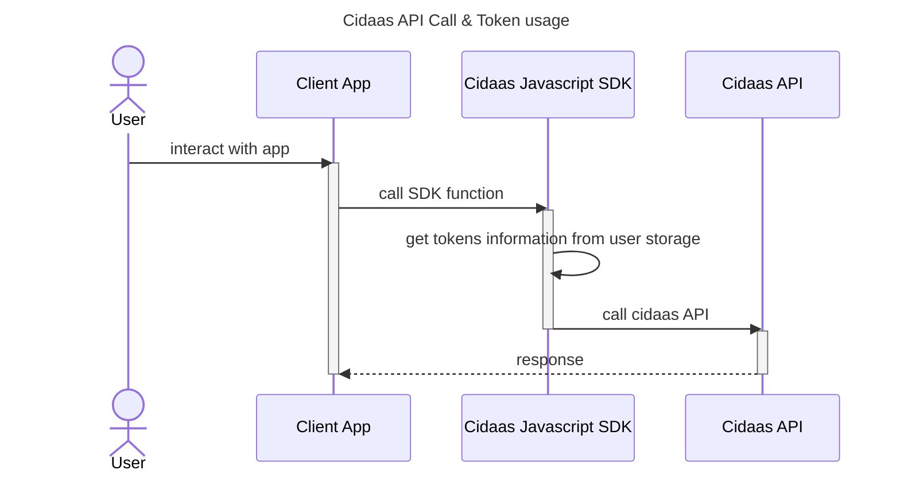
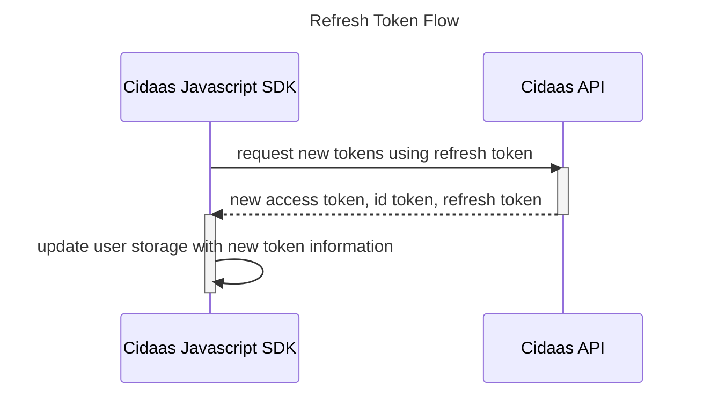

# Access Token Management

## Storing & Getting Access Token Information

After successful authentication using SDK [PKCE Flow](pkce-flow.md), tokens information such as access token, id token as well as refresh token will be saved by the SDK in user storage by default.
User Profile Information which are contained in id token will also be stored in the user storage

By calling getUserInfoFromStorage(), this informations can be retrieved by [user manager](overview.md#user-manager). Javascript SDK will set the token on each of Cidaas API request, when it is needed.

## Refresh Token Flow

Cidaas Javascript SDK will renew the token stored in the user storage, one minute before the token expired, by default. This behaviour can be disabled in case it is not wished.

By calling renewToken(), the token will be refreshed manually regardless of remaining time.

## Offline Access Token Check

Cidaas Javascript SDK provides offline access token check, which verify the following information of the token:
* whether the token has been expired
* whether the SDK knows the issuer of token 
* whether the SDK knows the scopes in the token

The SDK will use [Oidc Settings](overview.md#oidc-settings) to check whether the information contain in the token is valid.
