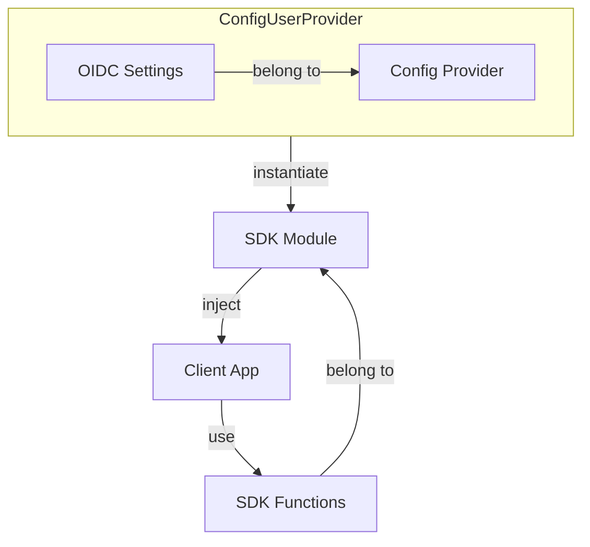

# Configuration

To configure Cidaas Javascript SDK you will need to provide oidc settings, which contains informations such as:

* authority: Cidaas instance base url
* client_id: Client application's identifier, which could be found in cidaas admin ui
* redirect_uri: URL to be redirected after successful login attempt.

This will be used to instantiated various modules, to communicate with cidaas api.

