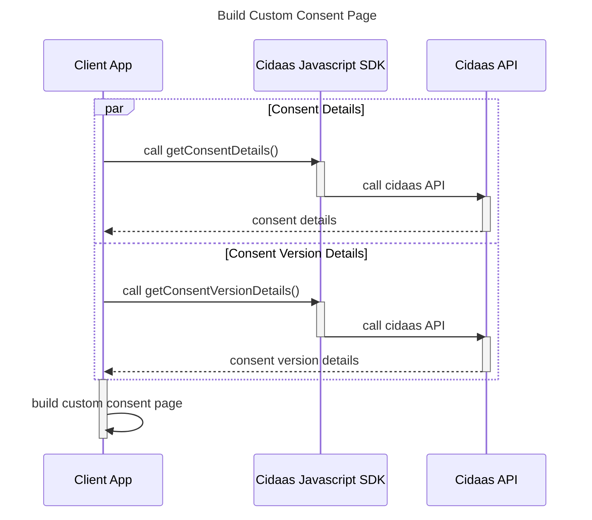
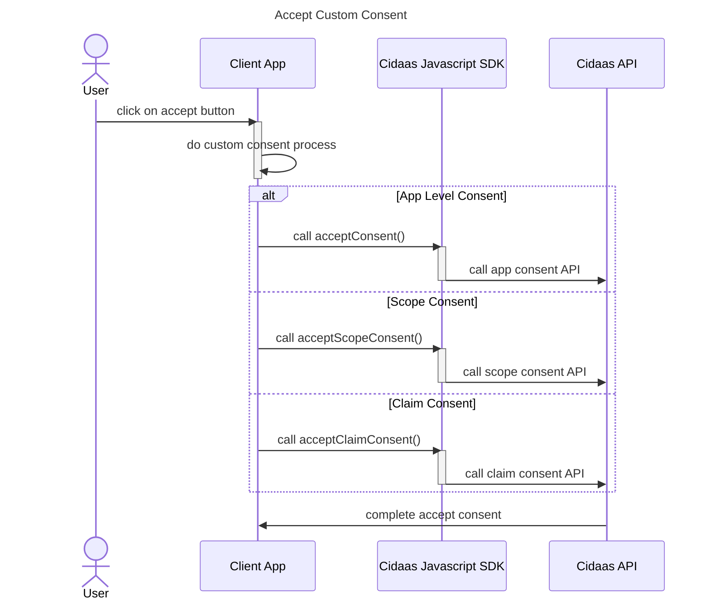

# Consent Management

By using getConsentDetails() as well as getConsentVersionDetails(), it is possibile to get all consent details and build custom consent page / flow based on the details.

Cidaas provides 3 types of consents: 
* app level consent
* scope consent
* claim consent

To accept these different consents, the following functions should be called:
* acceptConsent()
* acceptScopeConsent()
* acceptClaimConsent()

