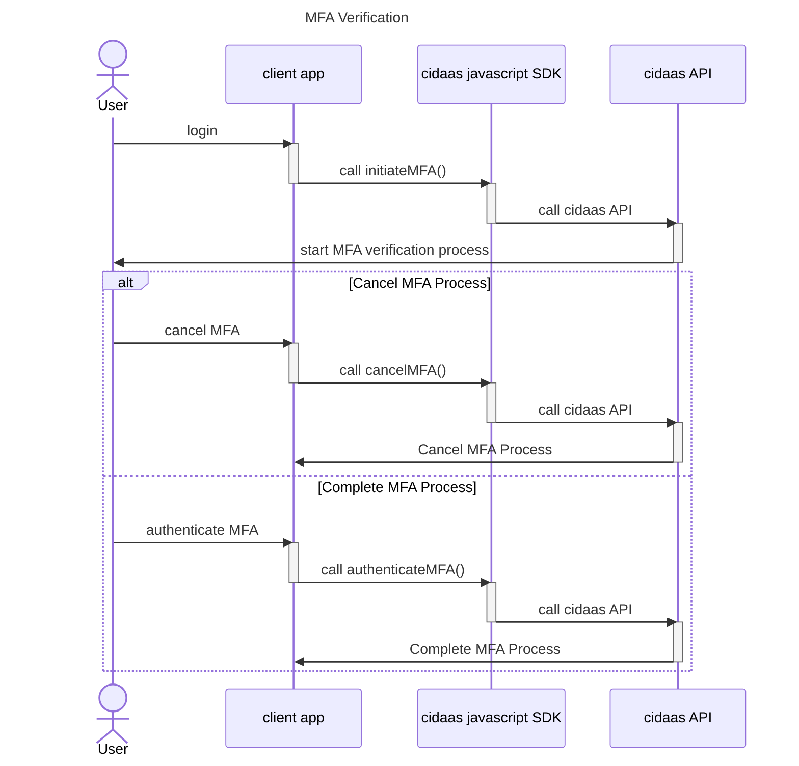
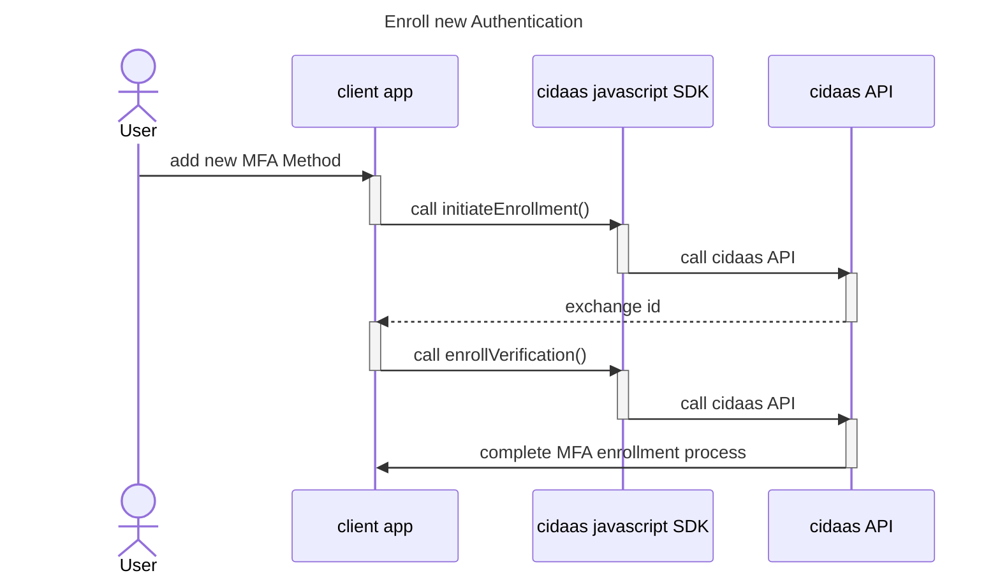

# Multifactor Authentication

Cidaas javascript SDK provides functions which calls cidaas api for managing multifactor authentication as following:

| SDK Function | Description |
|----------------- | ----------------------- |
|  getMFAList | Get all mfa, which has been configured by current active user |
|  getAllVerificationList | Get all mfa possibilities for the client app |

## MFA Verification

By calling initiateMFA(), user will start MFA verification process. From here user will be able to either complete the MFA process or cancel it. By calling authenticateMFA() and finishing authentication e.g. by providing pass code, the MFA verification process will be completed. Whereas calling cancelMFA() will cancel and end the verification process.

## Enroll new Authentication Method

To enroll a new MFA method, you can call initiateEnrollment() function. This will generate exchange id, which will be used by enrollVerification() to complete enrollment process.

By using getEnrollmentStatus(), the status of enrollment process can be tracked.
By using checkVerificationTypeConfigured(), you can check whether a specific MFA method has been enrolled.