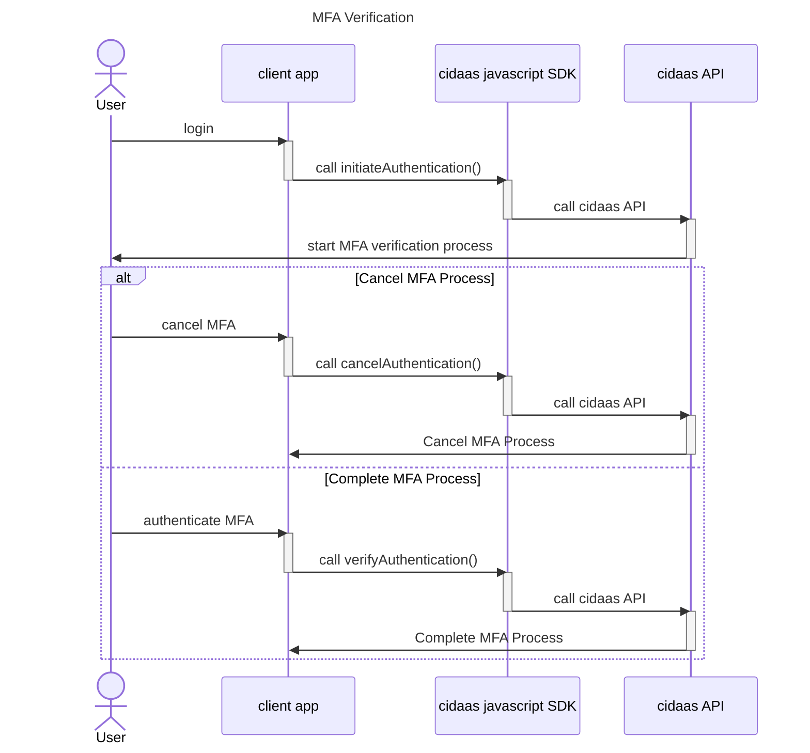
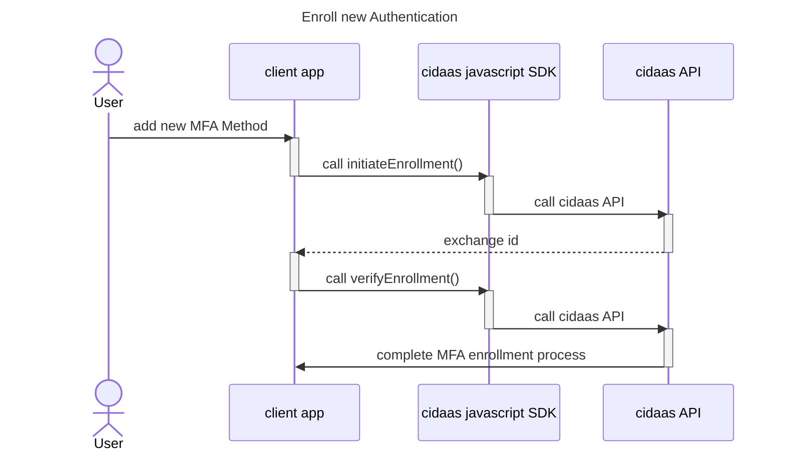

# Multifactor Authentication

Cidaas javascript SDK provides functions which call cidaas APIs for login-time authentication (verification-srv `/authentication/{method}/...`).

| SDK Function (preferred) | Deprecated alias | Description |
|----------------- | ----------------------- | ----------------------- |
| getConfiguredAuthenticationMethods | getMFAList | Methods configured for the current user (pre-login / MFA screen) |
| getAllVerificationMethods | getAllVerificationList | Verification methods configured for the client app |

> **v6:** See [UPGRADING_V6.md](../UPGRADING_V6.md) for migration from v5.x.

## Authentication verification

Call **initiateAuthentication(method, options)** to start a step, then **verifyAuthentication(method, options)** to complete it, or **cancelAuthentication(method, options)** to abort.

Deprecated equivalents: `initiateMFA()`, `authenticateMFA()`, `cancelMFA()`.

```mermaid
---
title: MFA Verification
---
sequenceDiagram
  Actor User 
  participant ClientApp as client app
  participant CidaasSDK as cidaas javascript SDK
  participant CidaasAPI as cidaas API

User ->> ClientApp: login

activate ClientApp
ClientApp ->> CidaasSDK: call initiateAuthentication()
deactivate ClientApp

activate CidaasSDK
CidaasSDK ->> CidaasAPI: call cidaas API
deactivate CidaasSDK

activate CidaasAPI
CidaasAPI ->> User: start MFA verification process
deactivate CidaasAPI


alt Cancel MFA Process
    User ->> ClientApp: cancel MFA

    activate ClientApp
    ClientApp ->> CidaasSDK: call cancelAuthentication()
    deactivate ClientApp

    activate CidaasSDK
    CidaasSDK ->> CidaasAPI: call cidaas API
    deactivate CidaasSDK

    activate CidaasAPI
    CidaasAPI ->> ClientApp: Cancel MFA Process
    deactivate CidaasAPI
else Complete MFA Process
    User ->> ClientApp: authenticate MFA

    activate ClientApp
    ClientApp ->> CidaasSDK: call verifyAuthentication()
    deactivate ClientApp

    activate CidaasSDK
    CidaasSDK ->> CidaasAPI: call cidaas API
    deactivate CidaasSDK

    activate CidaasAPI
    CidaasAPI ->> ClientApp: Complete MFA Process
    deactivate CidaasAPI
end
```

## Enroll new Authentication Method

To enroll a new method, call **initiateEnrollment(method, options, trackId?)**, then **verifyEnrollment(method, options)**.

Uses `verification-actions-srv/setup/{method}/initiation` and `.../verification`.

Deprecated: `initiateVerification`, `configureVerification`, `enrollVerification`, `configureFriendlyName`.

```mermaid
---
title: Enroll new Authentication
---
sequenceDiagram
  Actor User
  participant ClientApp as client app
  participant CidaasSDK as cidaas javascript SDK
  participant CidaasAPI as cidaas API

User ->> ClientApp: add new MFA Method

activate ClientApp
ClientApp ->> CidaasSDK: call initiateEnrollment()
deactivate ClientApp

activate CidaasSDK
CidaasSDK ->> CidaasAPI: call cidaas API
deactivate CidaasSDK

activate CidaasAPI
CidaasAPI -->> ClientApp: exchange id
deactivate CidaasAPI

activate ClientApp
ClientApp ->> CidaasSDK: call verifyEnrollment()
deactivate ClientApp

activate CidaasSDK
CidaasSDK ->> CidaasAPI: call cidaas API
deactivate CidaasSDK

activate CidaasAPI
CidaasAPI ->> ClientApp: complete MFA enrollment process
deactivate CidaasAPI
```

By using getEnrollmentStatus(), the status of enrollment process can be tracked.
By using checkVerificationTypeConfigured(), you can check whether a specific MFA method has been enrolled.