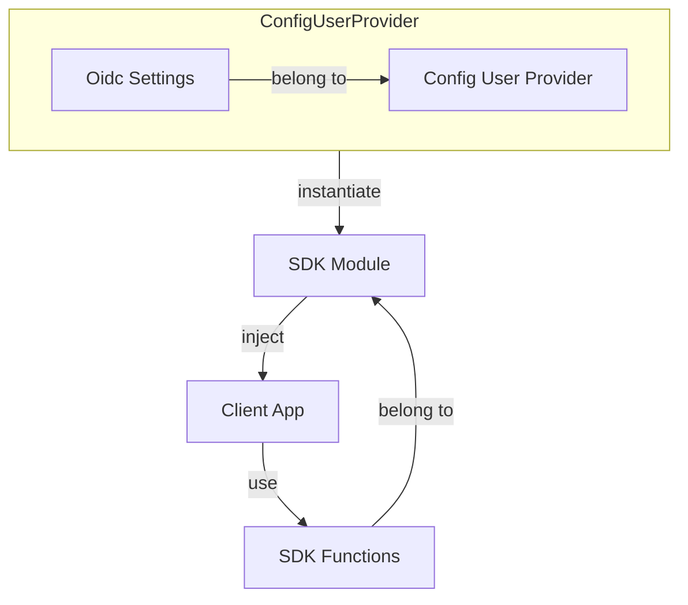

# Overview

Cidaas Javascript SDK helps integrating cidaas to your client application easily. It manages tokens and communicate with cidaas apis.

After adding Cidaas Javascript SDK Library to client side application and [configuring](#configuration) it using [Oidc Settings](#oidc-settings), it will be able to integrate cidaas functionalities such as:

* authenticating user using [PKCE flow](pkce-flow.md)
* [session management](session-management.md)
* [user management](user-management.md)
* [consent management](consent-management.md)
* implementing [multifactor authentication](multifactor-authentication.md)

Aside from that, Cidaas Javascript SDK also provide useful functionalities such as:

* [access token management](access-token-management.md): storing, retrieving & renewal of tokens
* [automatically assign access token](access-token-management.md#storing--getting-access-token-information) to api calls which needs it
* [offline access token check](access-token-management.md#offline-access-token-check)
* providing data model for each of cidaas api calls

## Configuration

To configure Cidaas Javascript SDK, you will need to provide [Oidc Settings](#oidc-settings). Oidc settings is part of [Config User Provider](#config-user-provider) and it will be used to instantiate various modules, to communicate with cidaas api.

## Config User Provider

Cidaas Javascript SDK Config User Provider contains [Oidc Settings](#oidc-settings) as well as [User Manager](#user-manager). It will be used to [instantiate various modules](#configuration).

### Oidc Settings
Oidc settings will be used to configured [User Manager](#user-manager). The full list of oidc settings configuration can be found on [documentation site](https://cidaas.github.io/cidaas-javascript-sdk/interfaces/OidcSettings.html) site, with some notable properties:
* authority: cidaas instance, which will run the authentication & authorization process
* client_id: generated id from cidaas, which will be used to identify client app
* redirect_uri: redirection url after succesful authentication
* scope: list of scope, used to specify access privileges. Some examples of it includes:
  * To get refresh token, scope: `offline_access` needs to be provided
  * To be able to do registration, scope: `cidaas:register` needs to be provided
  * To be able to do cidaas invite flow, scope: `cidaas:invite` needs to be provided

### User Manager
User manager, which is created based on oidc settings, is responsible for user sign in using [PKCE flow](pkce-flow.md), [session management](session-management.md) as well as [managing user informations](access-token-management.md#storing--getting-access-token-information) such as access token, id token & refresh token.