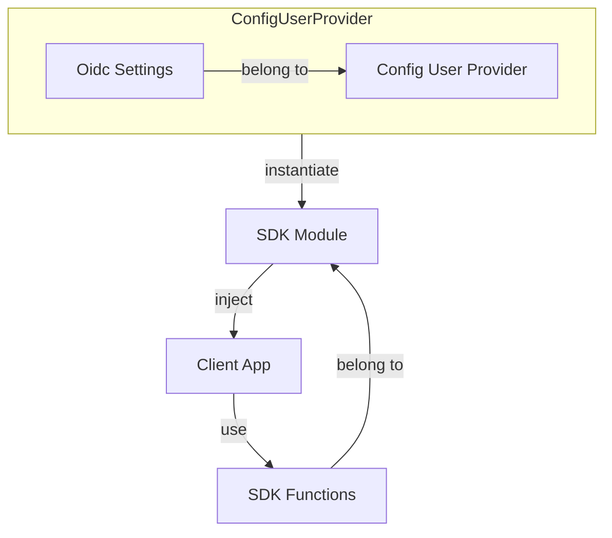

# Overview

Cidaas Javascript SDK helps integrating cidaas to your client application easily. It manages tokens and communicate with cidaas apis.

After adding Cidaas Javascript SDK Library to client side application and [configuring](#configuration) it using oidc settings, it will be able to integrate cidaas functionalities such as:

* authenticating user using [PKCE flow](pkce-flow.md)
* [session management](session-management.md)
* [user management](user-management.md)
* [consent management](consent-management.md)
* implementing [multifactor authentication](multifactor-authentication.md)

Aside from that, Cidaas Javascript SDK also provide useful functionalities such as:

* [access token management](access-token-management.md): storing, retrieving & renewal of tokens
* [automatically assign access token](access-token-management.md#storing--getting-access-token-information) to api calls which needs it
* providing data model for each of cidaas api calls
* offline access token check

## Configuration

To configure Cidaas Javascript SDK, you will need to provide Oidc Settings. Oidc Settings is part of [Config User Provider](#config-user-provider) and it will be used to instantiate various modules, to communicate with cidaas api.

## Config User Provider

Cidaas Javascript SDK Config User Provider contains configuration settings as well as user manager. Configuration settings will be used to [instantiate various modules](#configuration), while user manager is responsible for [managing user informations](access-token-management.md#storing--getting-access-token-information) such as access token, id token & refresh token.