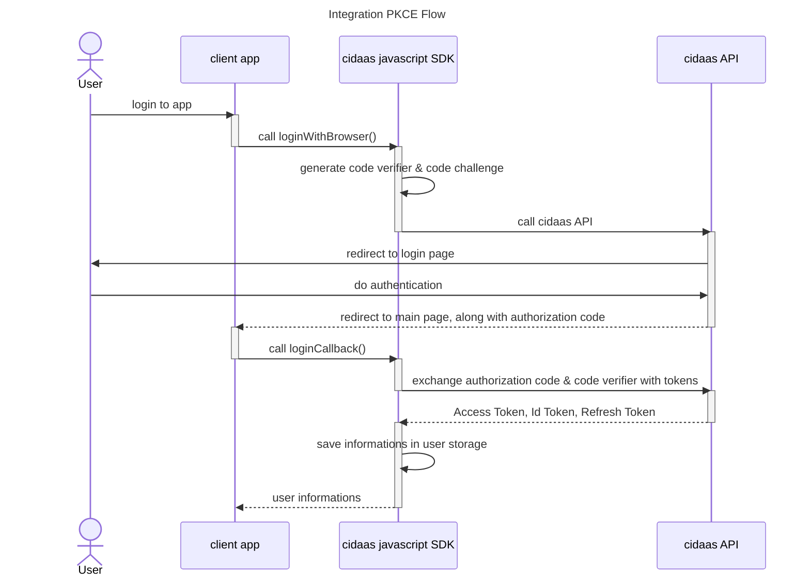

# Integrating PKCE Flow

By calling loginWithBrowser() function, the sdk will call cidaas authz url, which will resolve into user predefined login url. This could be either in form of default hosted page or custom login page, if configured.

After successful user authentication in the login page, user will be be redirected to predefined redirecturl, which has been configured in configuration file, alongside with code to be exchanged as tokens. 

By calling loginCallback() from the redirect url afterwards, the SDK will exchange the code from cidaas into tokens. This includes Access Token, Id Token & Refresh Token. The SDK will save the tokens afterwards as default behaviour. This can be disabled.

