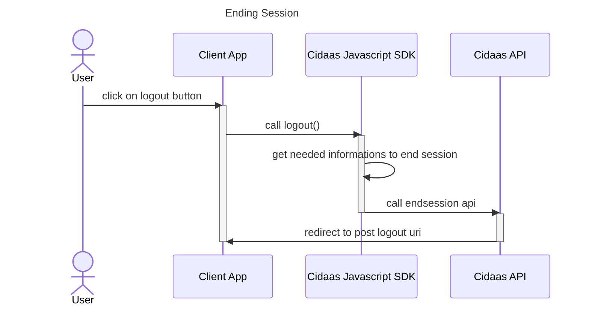

# Session Management

## Extending Session

Shortly before access token expired, Cidaas Javascript SDK will [automatically get a new token](access-token-management.md#refresh-token-flow), if refresh token is configured. To get refresh token, scope: `offline_access`needs to be provided in [OIDC Settings](overview.md#configuration). 

## Ending Session

By calling logout(), the sdk will call Cidaas endsession endpoint and providing needed parameters such as client id, id token hint as well as post logout url from configs & user storage to the endpoint.

