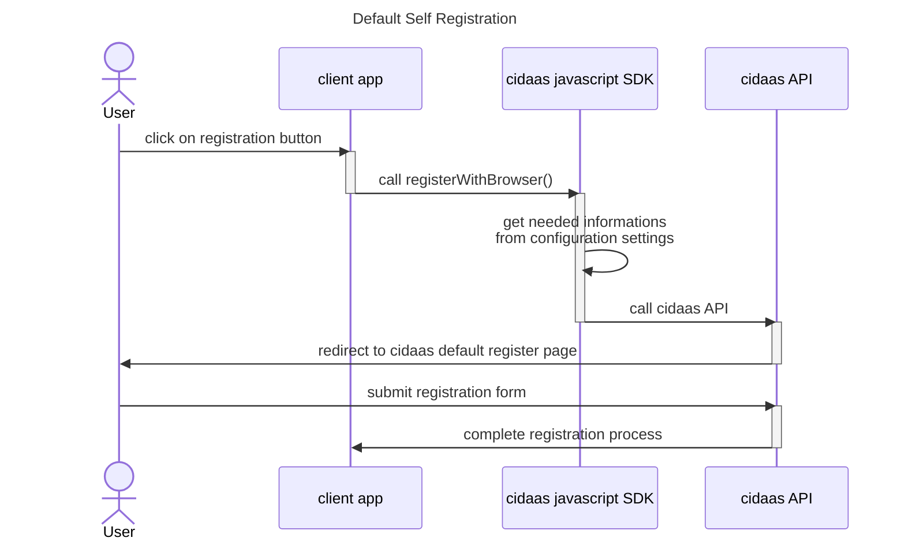
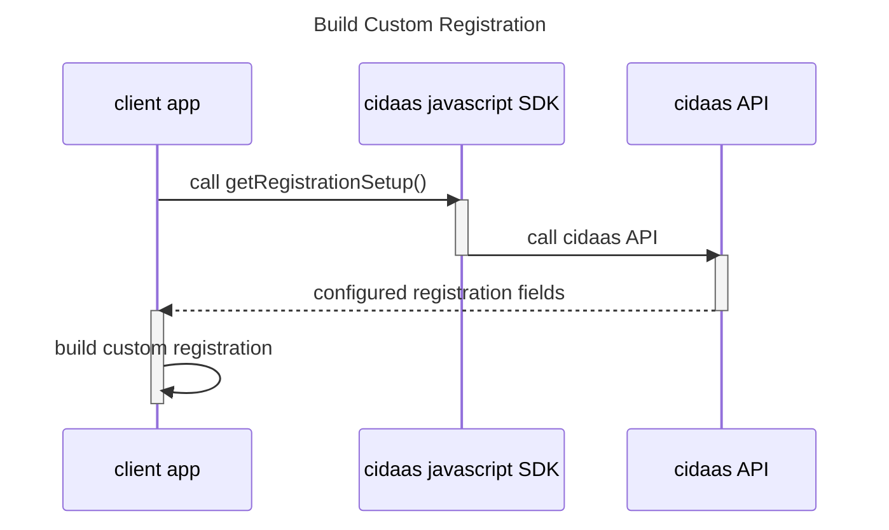
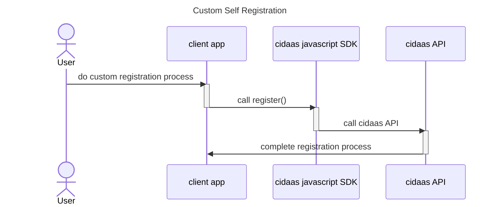
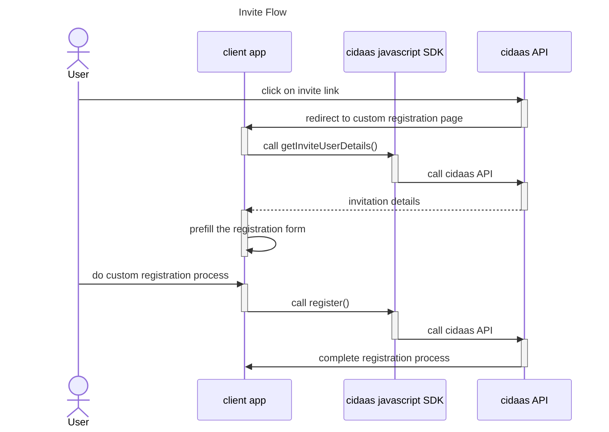
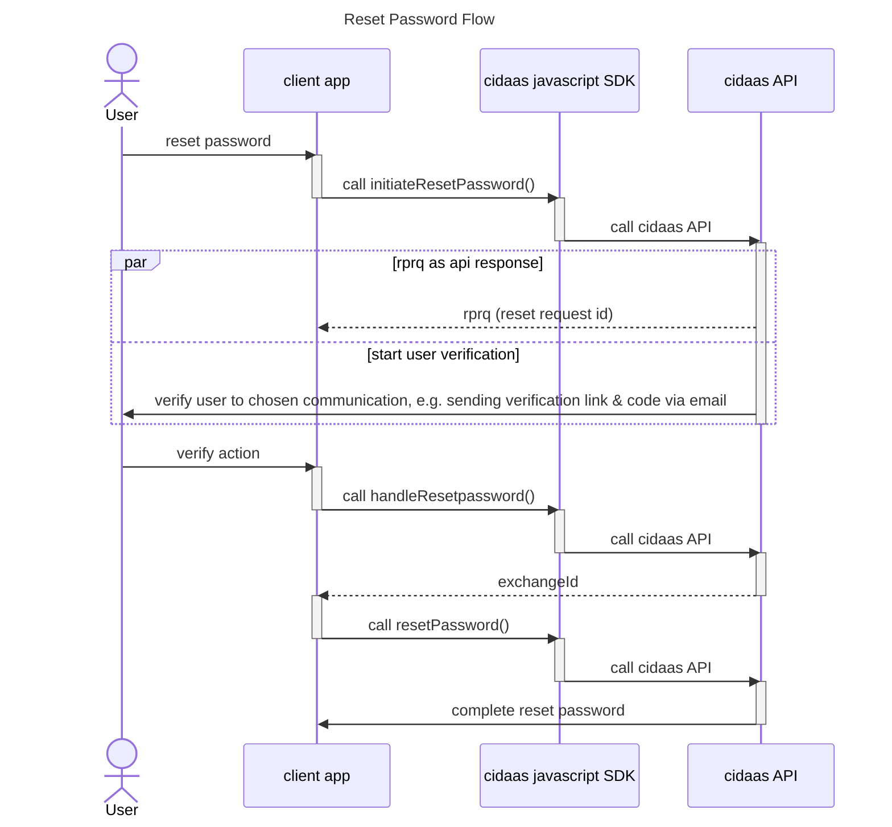
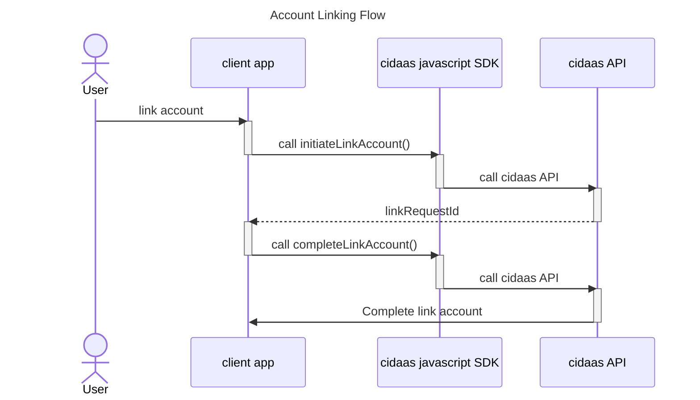

# User Management

Cidaas javascript SDK User module provides functions which calls cidaas api for managing user as following:

| SDK Function | Description |
|----------------- | ----------------------- |
|  getUserProfile | Get current active user information |
|  updateProfile | Update user information in a self service way |
|  deleteUserAccount | Instead of deleting a user instanly, the sdk will call cidaas api for schedule deletion. |

## User Creation Flow

A new user can be created either when a user do self registration or being invited by another user. Cidaas javascript SDK provides register function to create a new user, both as self registration and from user invitation. To be able to use self registration, ensure [Oidc Settings](overview.md#oidc-settings) to contains scope: `cidaas:register`.

### Default Registration

By calling registerWithBrowser(), user will be redirected to configured registration url, where user can complete registration process. By default client app will be redirected to cidaas registration page. 

### Custom Registration

It is possibile to use cidaas javascript SDK to build custom registration page / flow by getting all configured registration fields beforehand.

By calling register(), custom registration will be completed.

### Invite Flow
In case of [custom registration](#custom-registration), some informations need to be parsed from invite id, after user is being redirected by invite link. To be able to do cidaas invite flow, ensure [Oidc Settings](overview.md#oidc-settings) to contains scope: `cidaas:invite`.

## Reset Password Flow

Using cidaas javascript SDK makes it possible to build reset password functionality, which is provided by cidaas default hosted page, into client app if needed.

By calling initiateResetPassword(), user will start reset password flow, in which cidaas api will generate rprq to be used in the next steps, as well as verifying the process e.g. via verification link & code which is sent by email. 

By calling handleResetPassword(), the verification link, code as well as rprq will be process by cidaas api and after successful verification, the api will redirect browser to custom reset password page in client app, along with exchangeId, where user can change his password.

By calling resetPassword(), the new password, exchangeId from handleResetPassword() as well as rprq from initiateResetPassword() will be checked by cidaas api. After successful check, the password reset flow will be finished and new password will be set.

## Account Linking Flow

By calling initiateLinkAccount(), user will start account linking process. Link request id will be generated by cidaas api as response. 
By calling completeLinkAccount(), link request id from initiateLinkAccount will be used to complete account linking process

Cidaas javascript SDK also provide getLinkedUsers() function, which will return all linked users of current active user.
To unlink users, unlinkAccount() can be used.